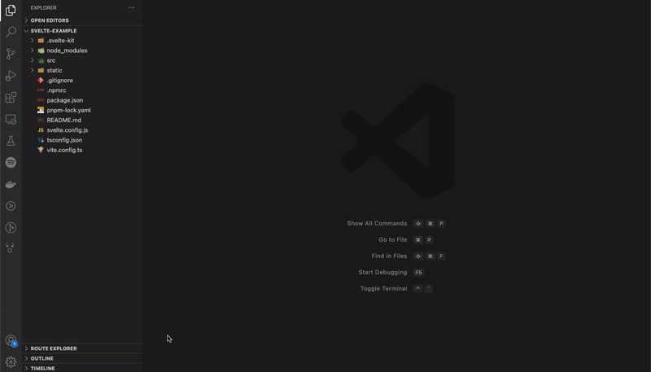
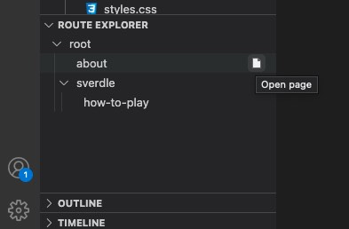

> This project is still experimental, and many core features are still unavailable. Feel free to contribute if you want!

# Directory Route Explorer

This VSCode extension helps you navigate between routes when developing applications using frameworks which use folders to define routes, such as Next.js or SvelteKit.

This helps deal with the issue of having multiple files called page.js or layout.js.

## Features

Allows you to easily browse routes using a tree view below your file explorer (or anywhere you want it to be)

Click to open the page, layout, server or error files (currently supports `+page.svelte` only)

 

Currently supports:
- [x] SvelteKit
- [ ] Next.js (Coming soon)

> A lot of the functionality is hardcoded for a SvelteKit project (eg. using +page.svelte), but if you really want, you could get it to work with a bit of modification.

 

## Todo

Features to be added:
- [ ] Implement event listener to update explorer when routes are added/deleted/renamed.
- [ ] Add icons to open `layout`, `error` and other framework files for each route.

 

Other non-critical features:
- [ ] Show route name instead of file name on tabs.
- [ ] Navigate between routes using the command palette.
